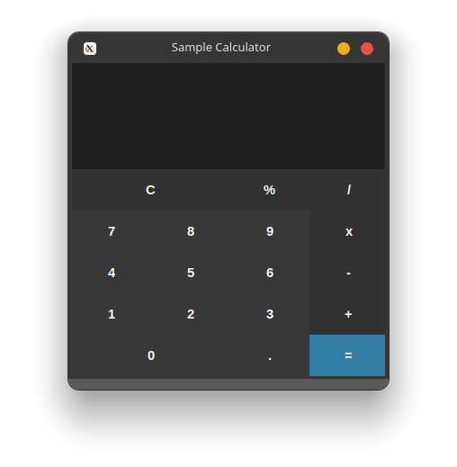
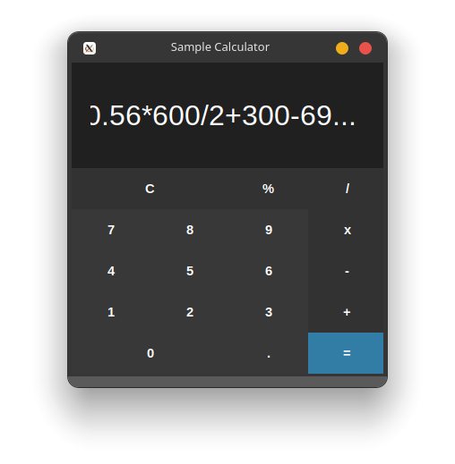

# Calculadora Python

<p align="left">
    
    <!--  -->
    
</p>

Calculadora simples em Python com interface gráfica.

## Funcionalidades do projeto
- `Calculadora simples:` calculadora simples para cálculos de soma, subtração, divisão, multiplicação e porcentagem.

<br>
<div display: inline_block align="center">
    
    
</div>

## Acesso ao projeto original
Esse é um fork do projeto original. O projeto original pode ser [acessado aqui](https://github.com/GabrielSchiavo/calculadora-python).

### O que foi alterado
+ Novos nomes para as variáveis
+ Mudanças visuais: Cores, fontes, tamanho da janela fixo, atualização constante do display para equações longas
+ Lógica para o botão porcentagem
+ Mensagens de erro quando tenta dividir por 0 ou insere uma expressão inválida
+ Botões em grade (grid)
- Retirado a importação ttk

### Appimage (linux) disponível na pagina de releases


## Abrir e rodar o projeto
Após baixar o projeto, você pode abrir com o Visual Studio Code. Para o projeto funcionar você deve ter configurado no seu PC:

* Python >= 3.10.5

Agora, na pasta do projeto abra um terminal e execute:
```bash
python calculadora.py
```

Agora o projeto está pronto para ser utilizado.

## Tecnologias utilizadas
* `Python - 3.10.5`
* `Tkinter - 8.6`
